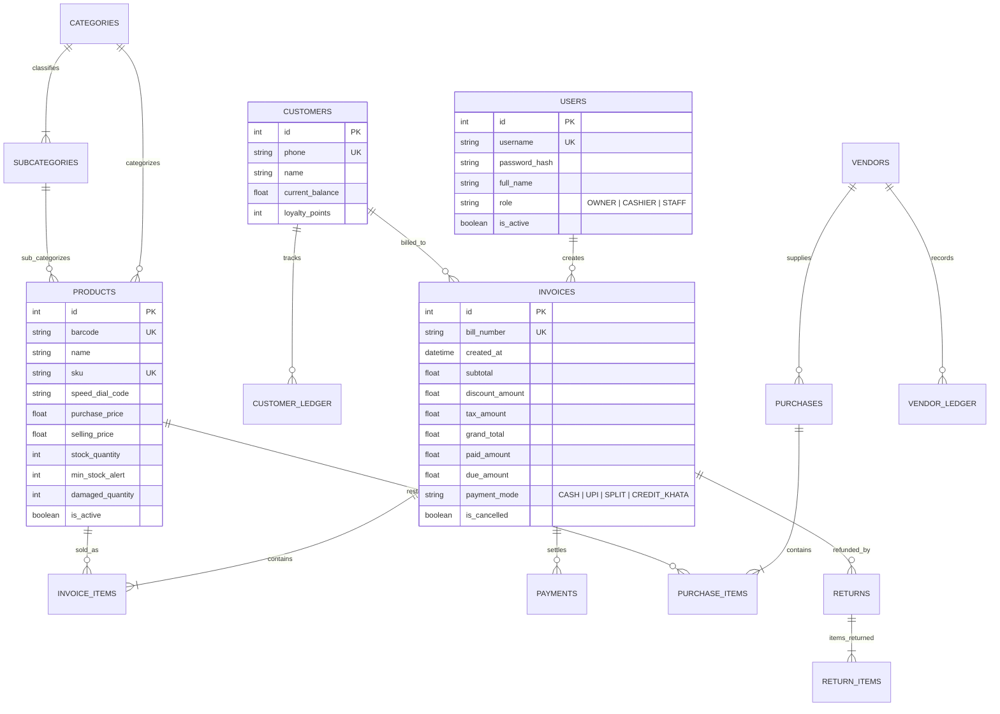

# Dolly POS — Dolly Toys & Kids Wear, Dhule
> **Modern, High-Speed Retail Management & Point-of-Sale (POS) System**  
> Engineered with FastAPI, PostgreSQL, React 18, TypeScript, and TSPL/ESC Thermal Printing.

---

## 1. Technology Stack & Pinned Versions

| Layer | Technology | Version | Purpose |
| :--- | :--- | :--- | :--- |
| **Backend Core** | Python (x64) | 3.12+ / 3.14 | Core REST API runtime and service execution |
| **API Framework** | FastAPI | `0.141.1` | High-throughput asynchronous REST API routing and validation |
| **Web Server** | Uvicorn (Standard) | `0.52.4` | ASGI HTTP server with high-concurrency connection pooling |
| **ORM / DB Driver** | SQLAlchemy / Psycopg2-binary | `2.0.52` / `2.9.12` | Relational ORM, query compilation & connection pool management |
| **Database Engine** | PostgreSQL (x64) | `16.x` | Multi-version concurrency control (MVCC) enterprise database |
| **Frontend Framework** | React 18 + TypeScript | `18.2.0` / `5.2.2` | Type-safe single-page retail counter web application |
| **Build Tool & Bundler** | Vite | `5.1.6` | Ultra-fast ES module bundler and hot module reload |
| **Styling & Design** | Tailwind CSS | `3.4.1` | Modern glassmorphic responsive design system |
| **UI Iconography** | Lucide React | `0.363.0` | Accessible and consistent vector icons |
| **Client State** | Zustand | `4.5.2` | Lightweight, persistent JWT authentication & POS cart state |
| **PDF Generation** | ReportLab | `5.0.1` | Programmatic thermal receipt & operational documentation PDFs |
| **Data Analytics** | Pandas / OpenPyXL | `3.0.5` / `3.1.5` | Excel spreadsheets (.xlsx) generation & financial crunching |

---

## 2. Complete Project Directory Structure

```text
Antigravity DollyPos/
├── DollyPOS_Launcher.bat           # Root 1-click launcher for counter terminals
├── LICENSE                          # MIT Open Source License
├── README.md                        # Master Technical Documentation & Architecture
├── dist_installer/                  # Compiled Windows Setup Installers (.exe)
├── docs/                            # Publication-grade PDF Documentation
│   ├── Dolly_POS_User_Manual.pdf
│   ├── Dolly_POS_Technical_Handoff.pdf
│   └── Dolly_POS_Disaster_Recovery_and_New_Laptop_Guide.pdf
├── installer/                       # Setup, Shortcut & Uninstallation Scripts
│   ├── Install-DollyPOS.bat         # Automated environment & desktop shortcut setup
│   ├── Uninstall-DollyPOS.bat       # Clean shortcut removal script
│   └── setup_inno.iss               # Inno Setup compiler definition
├── backend/                         # FastAPI Python Backend
│   ├── desktop_app.py               # Standalone desktop server runner
│   ├── requirements.txt             # Exact pinned Python dependencies
│   ├── .env.example                 # Clean configuration template
│   ├── app/
│   │   ├── config.py                # Global settings, DB connection string, JWT secrets
│   │   ├── main.py                  # FastAPI lifespan, seeders, and SPA router
│   │   ├── core/
│   │   │   ├── database.py          # SQLAlchemy SessionLocal & connection engine
│   │   │   └── security.py          # Password hashing (bcrypt) & JWT token encoders
│   │   ├── models/                  # SQLAlchemy Relational Models
│   │   │   ├── user.py              # User roles (Owner, Cashier, Staff)
│   │   │   ├── category.py          # Category & Subcategory hierarchies
│   │   │   ├── product.py           # Products, variants, barcodes, pricing
│   │   │   ├── invoice.py           # Invoices, items, payments (Cash/UPI/Khata)
│   │   │   ├── customer.py          # Customers, loyalty points & Khata ledger
│   │   │   ├── vendor.py            # Wholesale suppliers & vendor ledger
│   │   │   ├── purchase.py          # Purchase inward bills & items
│   │   │   ├── return_order.py      # Sales returns & credit vouchers
│   │   │   ├── expense.py           # Operating shop expenses
│   │   │   ├── settings.py          # Store information, thermal widths, socials
│   │   │   ├── audit_log.py         # Destructive action security audit trail
│   │   │   ├── lost_demand.py       # Out-of-stock customer demand tracker
│   │   │   └── whatsapp_log.py      # WhatsApp message dispatch logs
│   │   ├── api/                     # REST API Endpoints
│   │   │   ├── auth_router.py       # Login, token verification, master key PIN
│   │   │   ├── product_router.py    # Product CRUD, barcode lookup, speed dial
│   │   │   ├── invoice_router.py    # Fast checkout, split payment, bill hold
│   │   │   ├── customer_router.py   # Customer profiles, Khata Udhar collection
│   │   │   ├── vendor_router.py     # Vendor ledger & supplier settlement
│   │   │   ├── purchase_router.py   # Inward goods receipt & stock update
│   │   │   ├── returns_router.py    # Return order processing & inventory restock
│   │   │   ├── expense_router.py    # Shop expense logging & categorization
│   │   │   ├── reports_router.py    # P&L financial summary, YoY, Excel export
│   │   │   ├── settings_router.py   # Store customization & printer settings
│   │   │   ├── backup_router.py     # JSON database dump and restoration
│   │   │   └── marketing_router.py  # WhatsApp bulk campaigns & birthday cron
│   │   └── services/                # Business Logic Engines
│   │       ├── analytics_service.py # Sub-10ms SQL aggregations & smooth 5Y curve
│   │       ├── printer_service.py   # Raw TSPL barcode & ESC/POS receipt generation
│   │       └── whatsapp_service.py  # Cloud API messaging & automated birthday dispatcher
└── frontend/                        # React 18 + TypeScript SPA
    ├── package.json                 # Node dependencies & scripts
    ├── vite.config.ts               # Vite configuration & proxy
    ├── dist/                        # Optimized production distribution bundle
    ├── src/
    │   ├── App.tsx, main.tsx        # React Root & client-side routes
    │   ├── pages/                   # Main Page Views
    │   │   ├── DashboardPage.tsx    # KPIs, smooth 5Y chart & 50/30 retail pillar
    │   │   ├── BillingPage.tsx      # Barcode cashier checkout & thermal receipt
    │   │   ├── InventoryPage.tsx    # Stock management & 1-Up/2-Up barcode labels
    │   │   ├── CustomersPage.tsx    # Khata ledger, Udhar WhatsApp recovery
    │   │   ├── VendorsPage.tsx      # Wholesale suppliers, purchase inward orders
    │   │   ├── DamagedStockPage.tsx # Damaged/defective inventory tracking
    │   │   ├── MarketingPage.tsx    # WhatsApp festival campaigns & birthday hub
    │   │   ├── ReportsPage.tsx      # P&L accounting, YoY comparison, Excel export
    │   │   ├── SettingsPage.tsx     # Printers, sound toggle, master key, backup
    │   │   └── LoginPage.tsx        # Dual-role authentication gate
    │   ├── components/              # Reusable UI components
    │   ├── store/authStore.ts       # Zustand persistent JWT token store
    │   └── utils/api.ts             # Axios HTTP client with interceptors
```

---

## 3. Deep Code Walkthrough (Module by Module)

### Backend Architecture (`backend/app/`)

#### 1. `backend/app/core/database.py`
- **Class/Objects**: `engine`, `SessionLocal`, `Base`, `get_db()`.
- **Functionality**: Configures SQLAlchemy connection pool (`pool_size=20`, `max_overflow=10`, `pool_recycle=3600`).
- **Connection**: Used by all API routers via FastAPI dependency injection `db: Session = Depends(get_db)` for thread-safe database operations.

#### 2. `backend/app/services/analytics_service.py`
- **Class**: `AnalyticsService`
- **Functions**:
  - `get_dashboard_summary(db)`: Calculates real-time daily, monthly, and inventory valuation metrics in sub-10ms single SQL queries.
  - `get_analytics_charts(db, days, start_date, end_date)`: Computes smart time-bucketed datasets:
    - $\le 45\text{ days}$: Daily data points.
    - $46 - 400\text{ days}$: Clean 7-day weekly aggregates.
    - $> 400\text{ days}$ (5Y): 61 Monthly aggregates (`YYYY-MM`).
  - `get_dead_stock(db, days=60)`: Identifies idle products with no sales within specified days to highlight trapped capital.
- **Connection**: Called by `reports_router.py` and `DashboardPage.tsx`.

#### 3. `backend/app/services/printer_service.py`
- **Class**: `PrinterService`
- **Functions**:
  - `generate_1up_barcode_tspl(product, store_info)`: Emits raw TSPL commands (`SIZE 50 mm, 25 mm`, `GAP 3 mm, 0 mm`, `CODE 128`) for 1-Up barcode labels.
  - `generate_2up_barcode_tspl(products, store_info)`: Emits dual-column TSPL commands for 2-Up (100x50mm) label rolls.
  - `generate_receipt_escpos(invoice, store_info)`: Compiles ESC/POS bytes for 80mm thermal receipt printers with store header, barcode, itemized table, QR code, and auto-cutter pulse (`GS V 0`).
- **Connection**: Called by `product_router.py`, `invoice_router.py`, and `settings_router.py`.

#### 4. `backend/app/api/invoice_router.py`
- **Endpoints**: `POST /api/v1/invoices`, `GET /api/v1/invoices/{id}`, `POST /api/v1/invoices/{id}/cancel`.
- **Workflow**:
  1. Validates product stock availability.
  2. Creates immutable `Invoice` and child `InvoiceItem` records inside an ACID database transaction.
  3. Decrements `Product.stock_quantity`.
  4. Records payment split (`CASH`, `UPI`, `CREDIT_KHATA`).
  5. Updates `Customer.current_balance` if credit was incurred.
  6. Dispatches WhatsApp digital invoice via `whatsapp_service.py`.

#### 5. `backend/app/api/backup_router.py`
- **Endpoints**: `POST /api/v1/backup/create`, `POST /api/v1/backup/restore`, `POST /api/v1/backup/wipe-all`.
- **Workflow**:
  - Exports a relational snapshot into a standalone `.json` file while stripping machine-specific credentials.
  - Restoration uses topological dependency sorting with foreign key constraint safeguards to restore data cleanly in under 2 seconds.

---

## 4. Database Schema & Entity Relationship Diagram (ERD)



---

## 5. Historical Bug Log & Resolutions

| # | Issue Encountered | File / Module | Root Cause | Engineering Resolution |
| :- | :--- | :--- | :--- | :--- |
| 1 | **Database Restore Foreign Key Violation** | `backend/app/api/backup_router.py` | Deleting products during database restore violated foreign keys on `purchase_items` and `return_items`. | Added `ON DELETE CASCADE` to foreign keys on `purchase_items` and `return_items`, and wrapped restore in sequential topological deletion. |
| 2 | **Dashboard Net Profit Showing Negative Value** | `backend/app/services/analytics_service.py` | Expenses query was not bounded to today's date range, subtracting lifetime store expenses from a single day's sales. | Strictly bounded `Expense.expense_date` between `00:00:00` and `23:59:59` of current day. |
| 3 | **5-Year Timeline Chart Clutter** | `frontend/src/pages/DashboardPage.tsx` | Plotting 1,825 daily points created dense, jagged vertical line spikes across 1,000 horizontal pixels. | Implemented backend monthly aggregation (61 points) and frontend Monotone Cubic Bézier Spline paths (`M... C...`). |
| 4 | **Damaged Stock Product Search Dropdown Sticking** | `frontend/src/pages/DamagedStockPage.tsx` | Search dropdown lacked click-outside / blur handler, staying open indefinitely. | Added active input focus tracking and click-outside dismissal refs. |
| 5 | **Footer Settings Desynchronization** | `frontend/src/pages/SettingsPage.tsx` | Settings changes were saved into browser `localStorage` while receipt printing read from database. | Migrated all footer styling (font size, bold, terms) to database table `store_settings` with live synchronization. |

---

## 6. Key Architectural Design Decisions

1. **PostgreSQL vs SQLite**:
   - *Decision*: Adopted PostgreSQL 16 over SQLite.
   - *Rationale*: Multi-terminal concurrent counter billing with connection pooling prevents database locks during simultaneous barcode scanning and background reporting.

2. **Self-Contained Desktop Runner (`desktop_app.py`)**:
   - *Decision*: Built a Python desktop runner that serves the compiled React SPA directly via FastAPI static files.
   - *Rationale*: Eliminates the need to run separate Node.js / Vite development servers on counter terminals. Clicking `DollyPOS_Launcher.bat` starts the full stack in a single lightweight process.

3. **Direct TSPL / ESC Printing over Windows Spooler**:
   - *Decision*: Implemented raw TSPL and ESC/POS command generation in `printer_service.py`.
   - *Rationale*: Guarantees instant sub-second barcode label printing without printer spooler alignment skew or driver font distortion.

4. **50/30 Retail Margin Balancing Rule**:
   - *Decision*: Built automated margin classification into `AnalyticsService`.
   - *Rationale*: Enforces retail discipline by balancing high-margin impulse items ($\ge 45\%$) with core volume drivers ($25-45\%$) to maintain a blended $40-45\%$ store profit margin.

---

## 7. Operational Quick Start

### Starting the Application:
Double-click `DollyPOS_Launcher.bat` in the project root folder. Dolly POS will start and launch in your default web browser at:
```text
http://127.0.0.1:8000
```

### Default Credentials:
- **Owner Admin**: Username: `admin` | Password: `somesh123` (or `admin123`)
- **Counter Staff**: Username: `staff` | Password: `staff123`
- **Master Security PIN**: `9999`
